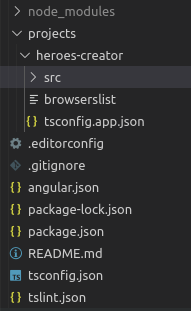

Após a [explicação do conceito envolvendo Angular Elements (incluindo referências)](https://dev.to/wilmarques/angular-elements-introducao-351n), vou demonstrar como implementar um componente simples.

## O que será feito

Utilizaremos a [Angular CLI](https://angular.io/cli/) para criar uma aplicação e convertê-la para Angular Elements.

Teremos como base o exemplo disponível no [tutorial do Angular, Tour of Heroes](https://angular.io/tutorial).

Porém, para simplificar o processo, nesse primeiro momento criaremos apenas a listagem e adição de heróis, não o dashboard.

Nesse exemplo, uma aplicação Angular comum terá a responsabilidade de inclusão dos heróis, enquanto um Angular Elements exibirá a listagem.

Ilustração do que será construído:


## Configuração do ambiente

Antes de tudo, devemos ter um ambiente corretamente configurado para o processo ocorrer conforme o esperado.

> Mais detalhes sobre a configuração do ambiente podem ser obtidos na [documentação oficial](https://angular.io/guide/setup-local).

### Node e NPM

A versão 10 do Node é a atualmente recomendada, tanto pelo Angular quanto pela própria equipe do Node.

Uma ótima opção para realizar a instalação é usar algum gerenciador, por exemplo [nvm](https://github.com/nvm-sh/nvm) ou [nvs](https://github.com/jasongin/nvs), porém o [site oficial](https://nodejs.org/) tem instruções para instalação em cada sistema operacional.

A vantagem em usar um gerenciador é a facilidade de atualização e possibilidade em se ter diferentes versões do Node em um mesmo equipamento.

> O Node 8 não é mais recomendado, principalmente por estar chegando no [fim do seu ciclo de vida](https://nodejs.org/en/about/releases/).

O [NPM](https://www.npmjs.com/) é instalado em conjunto com o Node, sendo 6 a [versão mais atual](https://github.com/npm/cli/releases).

### Angular CLI

Para instalar a Angular CLI, basta executar o seguinte comando na linha de comando:

```bash
npm install -g @angular/cli@^8
```

Após a instalação, execute esse comando para verificar o correto funcionamento:

```bash
ng version
```

Resultado do comando:


## Criação do projeto

### Workspace

A CLI do Angular possibilita a criação de diversos projetos dentro de um mesmo [workspace](https://angular.io/guide/glossary#workspace), para simplificar a criação de [monorepos](https://www.atlassian.com/git/tutorials/monorepos).

Para usufruirmos dessa funcionalidade, antes iniciaremos um workspace limpo (sem projetos) utilizando o comando [`ng new`](https://angular.io/cli/new):

```bash
ng new ng-elements --createApplication=false
```

### Aplicação inicial

Após o workspace ser criado, entraremos nele e adicionaremos uma aplicação simples com o seguinte:

```bash
cd ng-elements
ng generate application heroes-creator --minimal=true --prefix=hc --routing=false --style=css
```

> No comando acima, o parâmetro `--minimal=true` cria a aplicação sem a inicialização dos [testes unitários](https://angular.io/guide/testing) e [testes funcionais](https://angular.io/cli/e2e).
>
> O parâmetro `--prefix=hc` define _hc_ como prefixo para todos os componentes criados nessa aplicação, por exemplo `<hc-novo-heroi>`.
>
> `--routing=false` cria a aplicação sem [roteamento](https://angular.io/start/routing).
>
> Já `--style=css` cria o projeto sem um [pré-processador de CSS](https://tableless.com.br/pre-processadores-usar-ou-nao-usar/).

A execução do comando `ng generate` criará uma pasta _projects_, adicionará o projeto de nome _heroes-creator_ e alterará o arquivo `angular.json` com uma configuração para esse projeto especificamente.

Também modificará o arquivo `package.json` adicionando as dependências necessárias para a sua execução e as instalará.

Além disso, esse novo projeto passará a ser o padrão para qualquer comando executado neste workspace.

### Executando a aplicação

Após a aplicação ser criada, podemos executá-la com o seguinte comando:

```bash
ng serve
```

Tendo o seguinte resultado:


E com isso podemos abrir o endereço <http://localhost:4200/> no navegador e ver a aplicação em execução:


## Criação de heróis

### Componente principal

Agora que já temos uma aplicação (exemplo) funcional, podemos alterá-la para ficar de acordo com o esperado.

Todo o código dessa aplicação fica no diretório _src_ em _heroes_creator_, localizado na pasta _projects_, como a seguir:



Dentro da pasta _src_, encontramos a _app_ onde está contido o componente e o módulo principal da aplicação, `app.component.ts` e `app.module.ts`:


Antes de tudo, substituiremos o conteúdo do arquivo `app.module.ts` para:

```ts
import { BrowserModule } from '@angular/platform-browser';
import { NgModule } from '@angular/core';
import { FormsModule } from '@angular/forms';

import { AppComponent } from './app.component';

@NgModule({
  declarations: [
    AppComponent,
  ],
  imports: [
    BrowserModule,
    FormsModule,
  ],
  providers: [],
  bootstrap: [AppComponent],
})
export class AppModule { }
```

E o conteúdo do arquivo `app.component.ts` para:

```ts
import { Component } from '@angular/core';

@Component({
  selector: 'hc-root',
  template: `
    <h1>My Heroes</h1>
    <hc-creator (newHero)="addHero($event)"></hc-creator>
    <ul>
      <li *ngFor="let hero of heroes">
        {{ hero }}
      </li>
    </ul>
  `,
})
export class AppComponent {

  heroes: Array<string> = [];

  addHero(newHero: string): void {
    this.heroes = [
      ...this.heroes,
      newHero,
    ];
  }

}
```

Prestando atenção ao código acima, podemos ver uma referência a um componente ainda não criado, `hc-creator`. O criaremos agora utilizando os comandos da Angular CLI:

```bash
ng generate component creator --inlineStyle=true --inlineTemplate=true --skipTests=true --flat=true
```

> Os parâmetros usados acima fazem com que apenas um arquivo seja criado, contendo o template e styles ao invés de arquivos separados para cada um.
>
> Também não serão criados testes unitários, além de o arquivo ser criado na raiz do projeto, ao invés de estar contido em uma pasta própria.
>
> Exemplo do resultado do comando sem os parâmetros:
>
> 
>
> Exemplo com os parâmetros:
>
> 

Após esse componente ser criado, mude o conteúdo do seu arquivo `creator.component.ts` para:

```ts
import { Component, Output, EventEmitter } from '@angular/core';

@Component({
  selector: 'hc-creator',
  template: `
    <div>
      <label>Hero name:
        <input #heroName />
      </label>
      <button (click)="add(heroName.value); heroName.value=''">
        add
      </button>
    </div>
  `,
  styles: [`
    button {
      background-color: #eee;
      border: none;
      padding: 5px 10px;
      border-radius: 4px;
      cursor: pointer;
      cursor: hand;
      font-family: Arial;
    }

    button:hover {
      background-color: #cfd8dc;
    }
  `]
})
export class CreatorComponent {

  @Output() newHero = new EventEmitter<string>();

  add(heroName: string): void {
    if (heroName) {
      this.newHero.emit(heroName);
    }
  }

}
```

Com isso, podemos executar o projeto:

```bash
ng serve
```

E visualizar o resultado no navegador:


## Próximos passos

- [ ] Mudar aplicação para ser campo de nome e botão de adicionar
  - [x] Componente creator tem o botão add
  - [x] Botão add emite evento para o componente principal mandando o nome do herói
  - [x] Componente principal tem a lista de heróis
  - [x] Ao evento ser emitido, inclui herói na lista
  - [ ] Lista é passada para Angular Elements, o qual a exibe
- [ ] Criar angular elements
- [ ] Fazer angular elements receber e exibir a lista
- [ ] Importar angular elements na aplicação principal
