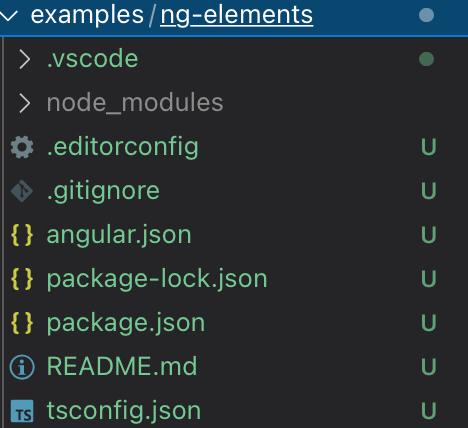

Após a [explicação do conceito envolvendo Angular Elements (incluindo referências)](https://dev.to/wilmarques/angular-elements-introducao-351n), vamos implementar um componente simples.

## O que será feito

O Angular, por ser um framework, traz diversas capacidades incluídas no seu pacote. Uma delas é a [Angular CLI](https://angular.io/cli/), capaz de criar projetos, trechos de código e ter outras responsabilidades.

Com a Angular CLI, criaremos um projeto e o converteremos para Angular Elements. Onde teremos como base o exemplo disponível no [tutorial do Angular, Tour of Heroes](https://angular.io/tutorial).

Porém, para simplificar o processo, criaremos apenas a listagem e adição de heróis, não o dashboard. Nesse exemplo, uma aplicação Angular comum terá a responsabilidade de inclusão dos heróis, enquanto um Angular Elements exibirá a listagem.

Ilustração do que será construído:


## Configuração do ambiente

Antes de tudo, devemos ter um ambiente corretamente configurado para o processo ocorrer conforme o esperado.

> Mais detalhes sobre a configuração do ambiente podem ser obtidos na [documentação oficial](https://angular.io/guide/setup-local).

### Node e NPM

A opção padrão para instalação do Node é utilizar o instalador oficial, disponível no site da própria ferramenta: <https://nodejs.org/>.

É altamente recomendada a instalação de uma versão LTS (Long Time Support), por ser mais  estável. A versão *current* (ou atual) é quase como uma versão *beta*, onde novas funcionalidades são testadas e é esperado um feedback da comunidade para trazer maior estabilidade na próxima LTS.

Mas ótima opção para realizar a instalação é usar algum gerenciador, por exemplo [NVM](https://github.com/nvm-sh/nvm) ou [NVS](https://github.com/jasongin/nvs). A vantagem em usar um gerenciador é a facilidade de atualização e possibilidade em se ter diferentes versões do Node em um mesmo equipamento.

Utilizando o NVS, para instalar a versão LTS do Node basta executar os seguintes comando no terminal:

```bash
nvs add lts
nvs use lts
```

E para verificar a instalação, pode-se executar um comando para a CLI do Node retornar a versão atualmente instalada. Como abaixo:


### Angular CLI

Após instalar corretamente o Node, podemos instalar a Angular CLI. Bastando executar o seguinte no terminal:

```bash
npm install -g @angular/cli
```

Tendo um resultado semelhante ao abaixo:


## Criação do projeto

### Workspace

A Angular CLI possibilita a criação de diversos projetos dentro de uma mesma estrutura, chamada de *workspace*.

Para a criação desses workspaces, algumas opções são oferecidas. Por padrão, uma aplicação simples é criada com algumas configurações iniciais. Mas aqui criaremos um repositório vazio, porque vamos adicionando os projetos individualmente e com maior controle desse processo.

Para criar um projeto vazio, executaremos o comando `ng new`, informando o nome do workspace (`ng-elements`) e informando à CLI para não criar a aplicação padrão, com o parâmetro `createApplication` recebendo o valor `false`:

```bash
ng new ng-elements --createApplication=false
```

A execução do comando tem como resultado a criação de um diretório com o mesmo nome atribuído ao workspace. Onde encontramos uma estrutura como a seguinte:



Um dos arquivos mais importantes em um workspace gerado com a Nx é o `angular.json`. Nele é possível encontrar todos os projetos presentes no workspace. No momento, ao abrir esse arquivo nos deparamos com uma estrutura vazia, justamente porque pedimos um workspace vazio:

```json
{
  "$schema": "./node_modules/@angular/cli/lib/config/schema.json",
  "version": 1,
  "newProjectRoot": "projects",
  "projects": {
  }
}
```

### Aplicação inicial

Após o workspace ser criado, entraremos nele e adicionaremos uma aplicação simples com o seguinte comando:

```bash
cd ng-elements
ng generate application heroes-creator --minimal=true --prefix=hc --routing=false --style=css
```

> No comando acima, o parâmetro `--minimal=true` cria a aplicação sem a inicialização dos [testes unitários](https://angular.io/guide/testing) e [testes funcionais](https://angular.io/cli/e2e).
>
> O parâmetro `--prefix=hc` define _hc_ como prefixo para todos os componentes criados nessa aplicação, por exemplo `<hc-novo-heroi>`.
>
> `--routing=false` cria a aplicação sem [roteamento](https://angular.io/start/routing).
>
> `--style=css` cria o projeto sem um [pré-processador de CSS](https://tableless.com.br/pre-processadores-usar-ou-nao-usar/).

A execução do comando `ng generate` criará uma pasta _projects_, adicionará o projeto de nome _heroes-creator_ e alterará o arquivo `angular.json` com uma configuração para esse projeto especificamente, o deixando o padrão para qualquer comando executado neste workspace:

```json
{
  "$schema": "./node_modules/@angular/cli/lib/config/schema.json",
  "version": 1,
  "newProjectRoot": "projects",
  "projects": {
    "heroes-creator": { // <- Aplicação gerada
      "projectType": "application",
      // Demais propriedades
    }
  },
  "defaultProject": "heroes-creator" // <- Projeto padrão
}
```

Também modificará o arquivo `package.json` adicionando as dependências necessárias para a sua execução e as instalará.

### Executando a aplicação

Após a aplicação ser criada, podemos executá-la com o seguinte comando:

```bash
ng serve
```

Tendo o seguinte resultado:


E com isso podemos abrir o endereço <http://localhost:4200/> no navegador e ver a aplicação em execução:


