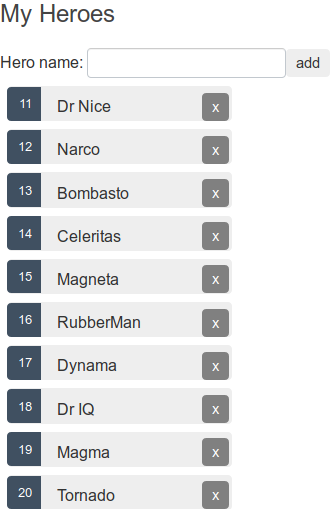

Após a [explicação do conceito envolvendo Angular Elements (incluindo referências)](https://dev.to/wilmarques/angular-elements-introducao-351n), vamos implementar um componente simples.

## O que será feito

O Angular, por ser um framework, traz diversas capacidades incluídas no seu pacote. Uma delas é a [Angular CLI](https://angular.io/cli/), capaz de criar projetos, trechos de código e ter outras responsabilidades.

Mas ainda assim usaremos uma alternativa à essa CLI, a [Nx](<https://nx.dev>). Por ter algumas vantagens interessantes sobre a Angular CLI. Além de também oferecer mais uma oportunidade de aprendizado.

Com a Nx, criaremos um projeto Angular e convertê-lo para Angular Elements. Onde teremos como base o exemplo disponível no [tutorial do Angular, Tour of Heroes](https://angular.io/tutorial).

Porém, para simplificar o processo, criaremos apenas a listagem e adição de heróis, não o dashboard. Nesse exemplo, uma aplicação Angular comum terá a responsabilidade de inclusão dos heróis, enquanto um Angular Elements exibirá a listagem.

Ilustração do que será construído:



## Configuração do ambiente

Antes de tudo, devemos ter um ambiente corretamente configurado para o processo ocorrer conforme o esperado.

> Mais detalhes sobre a configuração do ambiente podem ser obtidos na [documentação oficial](https://angular.io/guide/setup-local).

### Node e NPM

A opção padrão para instalação do Node é utilizar o instalador oficial, disponível no site da própria ferramenta: <https://nodejs.org/>.

É altamente recomendada a instalação de uma versão LTS (Long Time Support), por ser mais  estável. A versão *current* (ou atual) é quase como uma versão *beta*, onde novas funcionalidades são testadas e é esperado um feedback da comunidade para trazer maior estabilidade na próxima LTS.

Mas ótima opção para realizar a instalação é usar algum gerenciador, por exemplo [NVM](https://github.com/nvm-sh/nvm) ou [NVS](https://github.com/jasongin/nvs). A vantagem em usar um gerenciador é a facilidade de atualização e possibilidade em se ter diferentes versões do Node em um mesmo equipamento.

Utilizando o NVS, para instalar a versão LTS do Node basta executar os seguintes comando no terminal:

```bash
nvs add lts
nvs use lts
```

E para verificar a instalação, pode-se executar um comando para a CLI do Node retornar a versão atualmente instalada. Como abaixo:


### Nx CLI

Após instalar corretamente o Node, podemos instalar a Nx CLI. Bastando executar o seguinte no terminal:

```bash
npm install -g nx
```

Tendo um resultado semelhante ao abaixo:


## Criação do projeto

### Workspace

Assim como a Angular CLI, a Nx possibilita a criação de diversos projetos dentro de uma mesma estrutura, chamada de *workspace*.

Para a criação desses workspaces, a Nx possui algumas opções. Por padrão, uma aplicação simples é criada com algumas configurações iniciais. Mas aqui criaremos um repositório vazio, porque vamos adicionando os projetos individualmente e com maior controle desse processo.

A fim de criar um workspace vazio, usaremos o comando `create-nx-workspace` com alguns parâmetros:

```bash
npx create-nx-workspace ng-elements --preset=empty --nx-cloud
```

> No comando acima, além de estarmos definindo o nome do workspace como `ng-elements`, podemos ver outros dois parâmetros: `preset` e `nx-cloud`.
> 
> No primeiro deles estamos definindo o valor `empty`, a fim de indicar à Nx CLI que queremos um workspace vazio.
> 
> No segundo parâmetro, estamos ativando a utilização da [Nx Cloud](https://nx.app).

A execução do comando tem como resultado a criação de um diretório com o mesmo nome atribuído ao workspace. Onde encontramos uma estrutura como a seguinte:


Um dos arquivos mais importantes em um workspace gerado com a Nx é o `workspace.json`. Tendo uma estrutura bastante similar ao já `angular.json` gerado pela Angular CLI, nele é possível encontrar todos os projetos presentes no workspace. No momento, ao abrir esse arquivo nos deparamos com uma estrutura vazia, justamente porque pedimos um workspace vazio:

```json
{
  "version": 2,
  "projects": {}
}
```

### Aplicação inicial

Após o workspace ser criado, podemos começar a criar os projetos. Começaremos então criando a aplicação inicial, chamada de `heroes-creator` com a Nx.

Nx é uma ferramenta extensível e com suporte a diferentes frameworks. Essa extensibilidade se dá através de plugins que precisamos instalar no workspace antes de executar comandos referentes àquele framework. Esses plugins são simplesmente bibliotecas que instalamos no repositório.

Para instalar o Angular, vamos executar:

```bash
npm install -D @nrwl/angular
```

Com o plugin instalado, podemos criar uma aplicação Angular executando o seguinte comando:

```bash
nx generate @nrwl/angular:app heroes-creator --prefix=hc --routing=false --e2eTestRunner=none --unitTestRunner=none --port=4200 --no-interactive --style=css
```

TODO: Explicar os parâmetros
