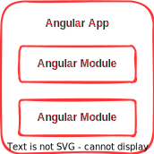
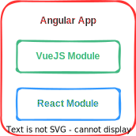
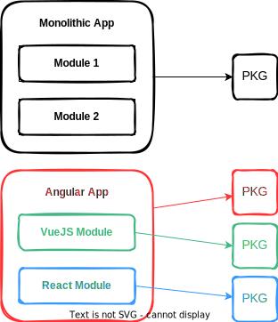
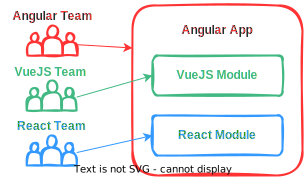

Most of the benefits of Micro Services also apply to Micro Front-Ends. Also, they both are great when combined. So, let's see some of them.

## Technology Agnostic

One thing commonly cited as an advantage in Micro Services is the freedom of choice regarding the technologies used in each service. And it's also true in Micro Front-Ends.

When creating a monolithic app, the framework used to develop it has to be the same in every module. For example, if the app is written in Angular, you have to stick with it in all the app.

<!--  -->

A Micro Front-Ends architecture brings the freedom to choose any framework in every module.

<!--  -->

## Isolation

Similar to what is possible in Micro Services, MFE modules can be isolated from the container app. It means this module can make choices that will only be available in it.

The first benefit of this isolation is styling. If you are working on a monolithic application, any business module has to follow the same style. It is that way because the CSS is shared across all the modules. Using MFE, you can set the module to not inherit the container app style and make it totally different.

The JavaScript framework world moves really fast nowadays. Angular, for example, has a new version twice a year. Although it's great for innovation, some companies just can't keep up with that and MFE can help here. Because each module can use any framework version it needs. Also, it's possible to update each module independently, making this process a bit easier.

On monolithic applications, third-party libraries are usually shared across all its modules. For small applications, it may be ok but for big applications maintained by multiple teams, it gets frustrating quickly. The isolation provided by MFE turns possible to use completely different libraries on each module.

It is all possible because MFE modules can be entirely self-contained. Meaning it can embed any library, framework, style, or anything else it needs. Although possible, it doesn't depend on the container on common scenarios.

## Independent Development

The life cycle of an MFE module doesn't depend on the other modules, or the container app, because it's isolated from them. So it's possible to have development phases separated from the rest of the application.

The independence of deployment, combined with the isolation cited before, brings the freedom to deploy each part of an app in a different infrastructure. For example, AWS can host the container app and Azure be used by the MFE module. Or even in different PODs in a Kubernetes cluster.

It's also easier to ship features. Because the team responsible for an MFE module can try new things with less impact on the rest of the application.

<!--  -->

## Scalability

The independence of deployment also makes it easier to scale the infrastructure of each feature independently.

It's possible, for example, to give more power to the container app infrastructure while limiting the resources allocated to an MFE module.

## Multiple Teams

As mentioned before, an MFE architecture makes it possible to have multiple teams working seamlessly on the same app. Each team can make any changes to the code with less impact on the others' work.

This way, it's possible to have a separate team responsible for each MFE module. So they don't have to think about how the container and other modules are structured.

It can lead to the development of multidisciplinary teams, with less needy for separation between front and back-end teams. This aspect helps to scale the development process.

<!--  -->

## Reusability

Depending on the strategy to build the modules, they can be reusable on different apps. The reusability aspects can be helpful when you have multiple apps with the same features. Instead of writing the same module twice, or more, you can write it as an MFE module and reuse it.

Not all MFE strategies can bring this benefit, but it's possible when you design the app using the capabilities brought by the browser. You can use what the frameworks provide, but it depends if you want to reuse a module on multiple apps using the same framework or not.

## Conclusion

Of course that some other benefits but the key points mentioned here show how this kind of architecture can help your development workflow.

Although it shouldn't be used anywhere, it can be great on the right use case.
