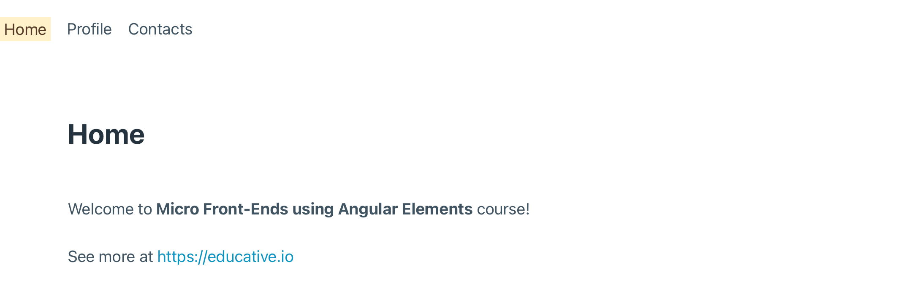
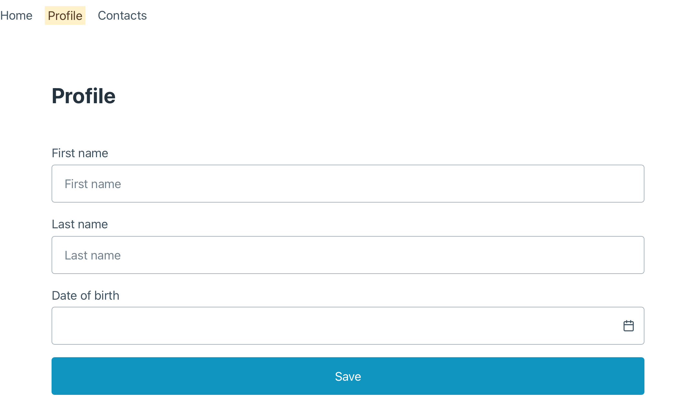
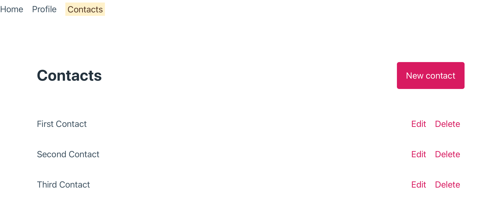
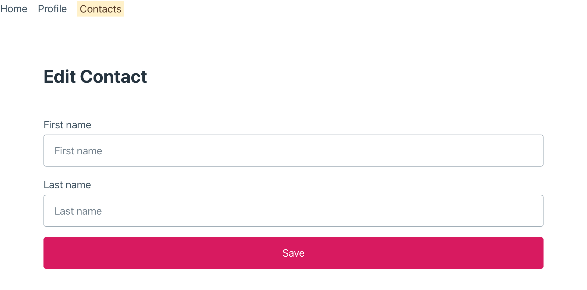

As the objective of this course is about structuring an MFE architecture, the app we will build together won't be very complex. Instead, it will be built with some features to illustrate how to do some communication between the container and an MFE module.

This app will be divided in three main areas: Home Page, Profile Page, and Contacts Page. The Home and Profile Page will be part of the container app. The Contacts Page will be our MFE module, which will also have a nested route to edit a Contact.

These are example of the pages that we will build:

The communication involved in this app will be used to:

- Change the accent color when the user enters the Contact Page
- Show in the container a title provided by the MFE module

The contact list presented by the MFE module will be fetched from an API that we'll also build.

It's a simple app in complexity, but the knowledge acquired to develop it will be useful in many MFE scenarios.
