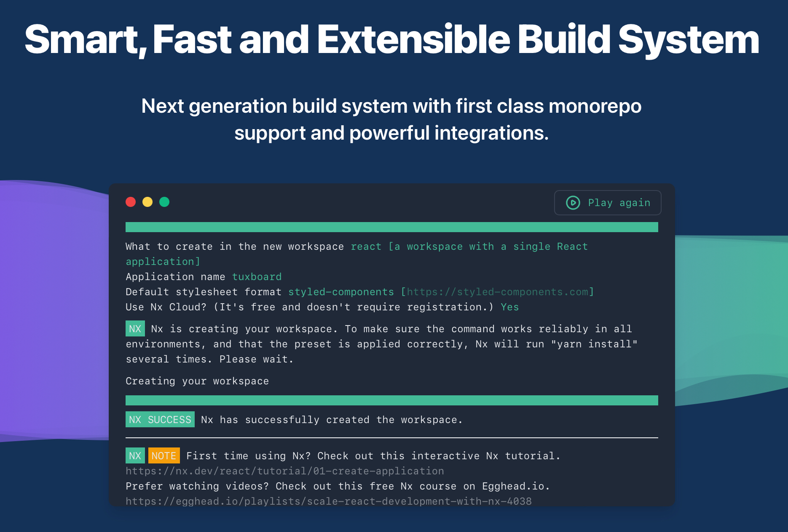
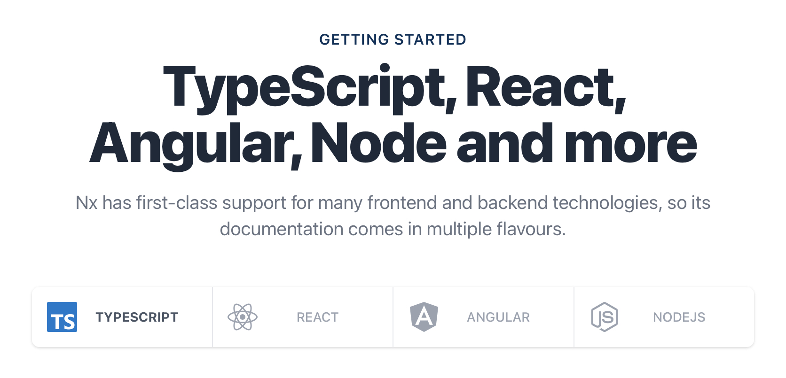

## Benefits

Nx is one of the more innovative tools for building web applications nowadays. It's vastly inspired in the Angular CLI and brings most of its benefits.

<!--  -->

Different than the Angular CLI, Nx can handle almost any technology available for app development. Its open-source model and extensibility through plugins bring a variety of possible technologies to be used. Not only Angular projects can benefit from it, but also React, VueJS, or even those built using Vanilla JS.

<!--  -->

With its built-in monorepo support, Nx will help us create the project we'll build together in this course. Since we'll deal not only with Angular but some other technologies, a tool like Nx is especially crucial. Using the Nx CLI we will be able to create, run and build all the projects in this course.

## Comparing to the Angular CLI

If you are used to the Angular CLI you will feel at home, because most of the commands are similar. For example, if you want to run an Angular app locally using its CLI you would run `ng serve`:

<!--  -->

While using Nx you would run `nx serve`:

<!--  -->

As said before, Nx also works with React and the output of the same `nx serve` command would be:

<!--  -->

The other common commands used on the Angular CLI are also available on Nx, like: `test`, `lint`, and `build`.

## Going further

One advantage Nx has over the Angular CLI is the capability of running multiple commands at once. On a regular Angular project, you would have to create `npm` scripts or use a third-party library like  `concurrently`.

Nx has the `run-many` command that does all the hard work for you. Imagine you have two projects on a workspace and want to serve them, you could simply run the command `nx run-many --target=serve --all` and let Nx do its work, like below: 

<!--  -->

Although Nx is a great tool it isn't the main object of this course, but it's important to know what you have at hand. So if you want to see more of its capabilities, go to their website: <https://nx.dev>.
