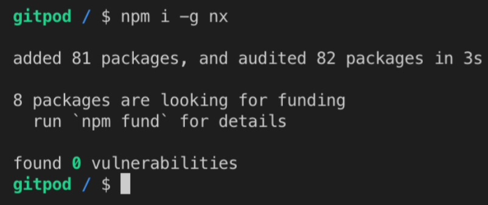
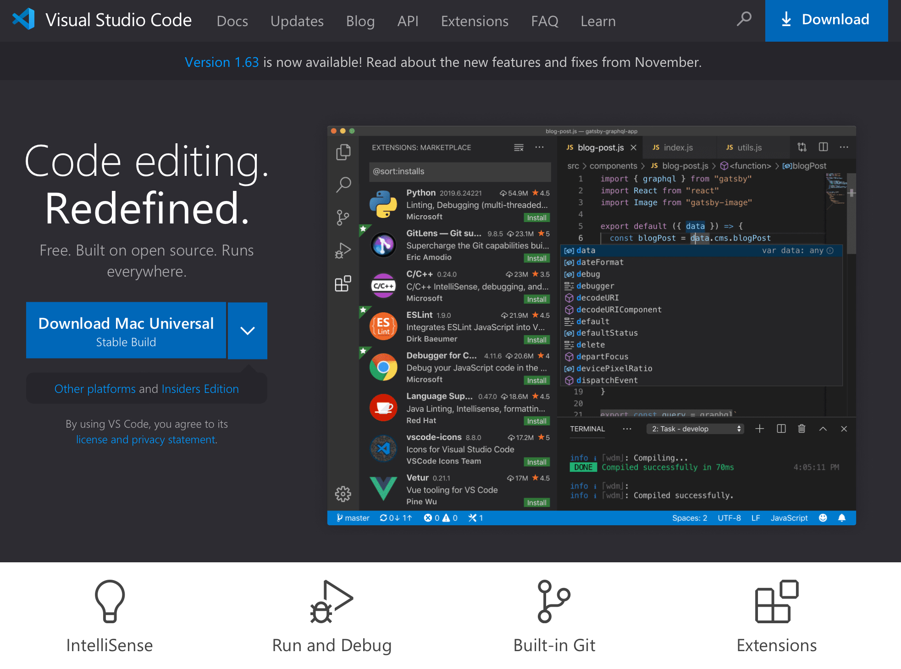

As we are building a front-end application, we are going to use two of the most popular front-end frameworks available nowadays: React and Angular.

Both of these frameworks run on top of Node, which will be required on the dev environment to do some needed tasks to develop an app: building and serving locally.

## Installing NodeJS

So let's start installing NodeJS, which can be downloaded from its official page: <https://nodejs.org/>.

But on that page, there's an indication of two NodeJS versions: LTS and Current.

<!--  -->

It's always recommended to download the LTS version because it's more stable. The Current version is not beta, but LTS is more stable. So just follow the instructions presented when you click the  LTS indication and you are good to go.

After downloading and installing Node, it's always good to test it with a simple command: `node -v`.

<!--  -->

Another good way to test Node is running a rather cool command: `npx cowsay Hello!`.

<!--  -->

> If it asks for permission to download a dependency, type `y` (yes) and enter to continue.

## Installing Nx

After a successful installation of Node, it's time to install one of the most important pieces of this course: Nx.

As said before, Nx has a lot of advantages and will help us a lot during our journey. It's not mandatory, but a way to get Nx is simply installing it globally using `npm`. So, open up your terminal, type `npm install -g nx`, and hit enter.

<!--  -->

## Code Editor

Integrated Development Environment, or IDE, is a tool that can be used to code an app. As there are many IDEs available, it's important to test them to see which one you prefer and what are your needs.

Sometimes an IDE is too much for what you are trying to accomplish. For that, you can use a more simple Code Editor. The differences between an IDE and a Code Editor may not be so clear but usually, IDEs bring more functionalities like debugging and deployment.

For Front-End development, the most popular Code Editors (or IDEs) are Visual Studio Code, WebStorm, and Sublime Text. Visual Studio Code, or just VSCode, is by far the most popular and will be the one used in this course.

The installation of VSCode is very simple and the instructions can be found on its official website (referred on the Appendix lesson). Where you find the following:

<!--  -->

There are two options: Stable and Insiders. If you like to try new things and accept some bugs that may appear, you can install the Insiders Edition. But the Stable version is recommended for most use cases.

## VSCode Extensions

VSCode is an extensible Code Editor. One way to extend its functionalities is by installing extensions, which are officially supported. There are a lot of extensions that can be found on the VSCode extensions bar or the marketplace (see Appendix).

For this course, two extensions aren't mandatory but may be helpful. **Angular Language Service** will operate in the background, providing you feedbacks while you code. **Nx Console** is not necessary, but can be used in the case where you don't want to open the terminal to do some tasks like building the app.
