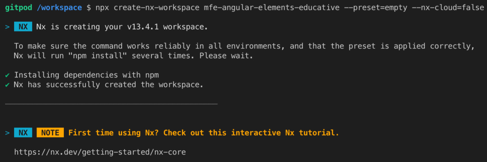
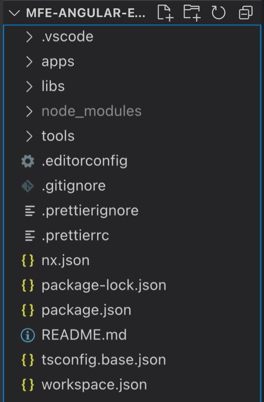

## What's a Workspace

To start the development of the apps we will create a workspace using Nx. But first, a workspace is a structure to hold all the projects we will work on. It's useful when working on monorepos, repositories with more than one project.

Each application or library inside a workspace is called a project. During this course, we will create three projects: a container app, an MFE module, and an API.

## Creating a Workspace

Nx has a ton of options for workspace creations. It has native plugins developed by the Nx team (<https://nrwl.io>), but there are many community plugins. All of them give us flexibility when creating our apps.

By now, we will only create the workspace without any apps in it. Nx creates an app using a default configuration that you can change during the process. But we will create an empty workspace because the apps will be created during the course.

To achieve that, run the following command in the terminal:

```bash
npx create-nx-workspace mfe-angular-elements-educative --preset=empty --nx-cloud=false
```

> To explain it a bit. `npx` is a Node tool used to run a Node binary without installing it. `create-nx-workspace` is the binary we want to execute, which is responsible for the creation of the workspace. `mfe-angular-elements-educative` is the name of the workspace. `--preset=empty` tells Nx to create an empty workspace. And `--nx-cloud=false` says that we don't want to use [Nx Cloud](https://nx.app).
> 
> Don't forget to point your terminal to the directory that you want to create the workspace.
> 
> In Linux it would be: `cd directory-name`

This is the result of the command:

<!--  -->


This command generates a new folder where it was executed. The name of the folder will be the same provided as the name of the workspace, in this case: `mfe-angular-elements-educative`.

## Inside of a Workspace

With the workspace created, you can open it on your IDE of choice and see the files created there.

The main file of an Nx workspace is `workspace.json`, which now may have similar content to what's below. You can see that the `projects` property doesn't have content because we created an empty workspace.

```json
{
  "version": 2,
  "projects": {}
}
```

When opening the workspace on the IDE, you can see this folder structure:

<!--  -->


> If you want to know more about this structure, follow this link to go to the official Nx doc: <https://nx.dev/l/a/getting-started/nx-setup#folder-structure>.

The most important folder for this course is the `apps` folder. You can see it's empty now, but it is where we will create the apps.

With the workspace now created, we can start creating the apps.
