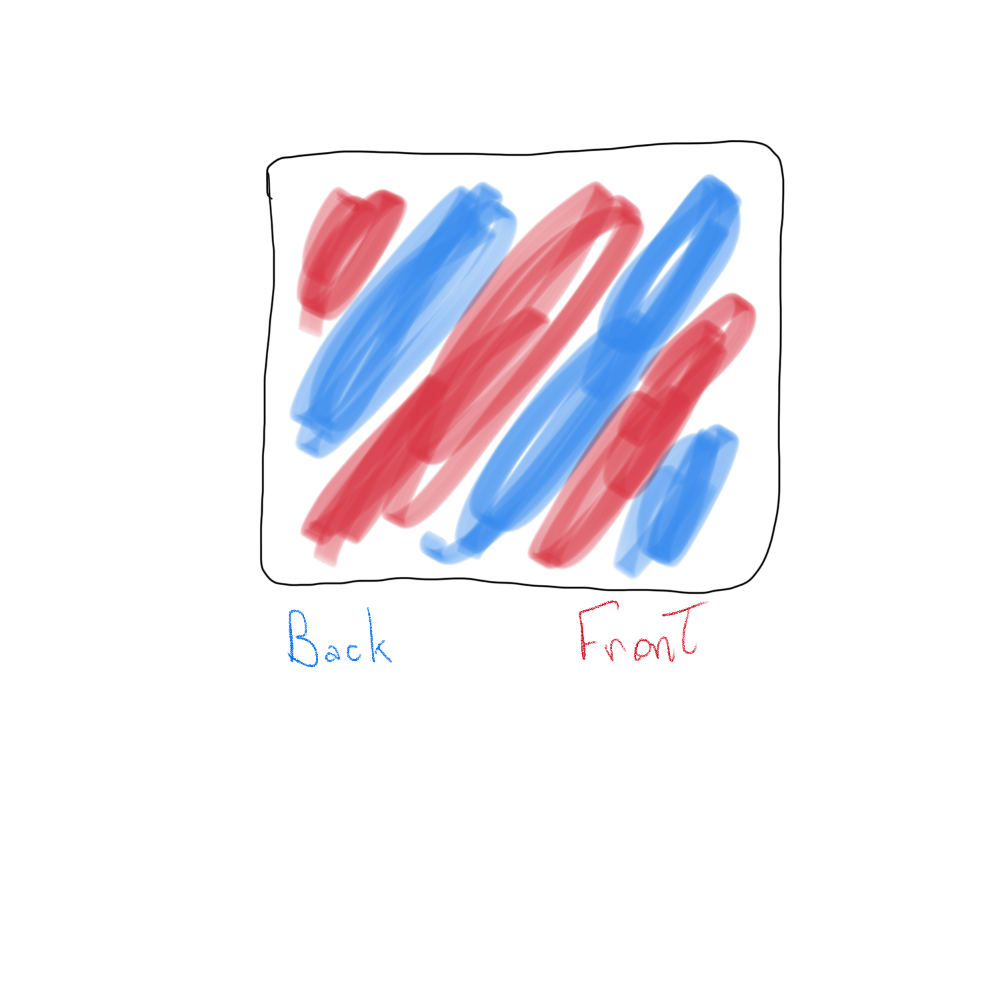
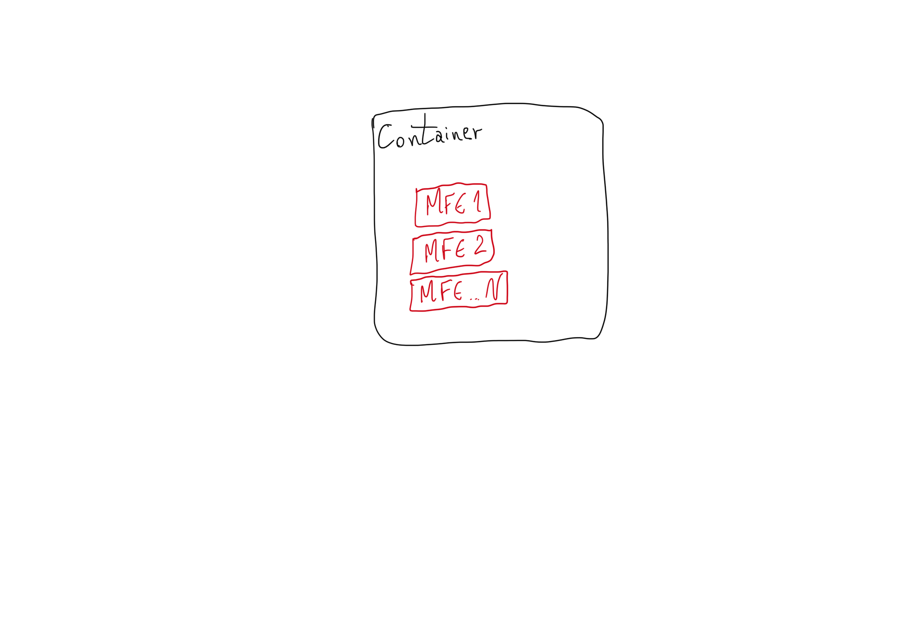

## What are Micro Front-Ends?

## Introduction

Micro Front-ends, despise the fancy name isn't something particularly new. It's, as most of the innovations, a group of techniques that tries to solve a problem.

The "problem" that is trying to be solved here is the ability to build scalable apps. But not simple apps, we are here dealing with large and complex apps. Which may have different teams working on it.

**Micro Front-Ends** are very similar to *Micro Services* architecture. A lot of the concepts are shared. Also some of its *challenges* and *benefits*.

## Evolution

But first, let's see how we got here. Because like everything in development, things start simple and then get more complex. It happens because we are constantly trying to solve the problems we face daily.

Maybe oversimplifying, we can divide the evolution of web apps architecture regarding separation of code into three "phases":

1. Monolith with back and front together
2. Separation from back and front
3. Back Micro Services, front Monolithic
4. Micro Front-Ends

The first phase was when the code that's executed on the server (AKA back-end) resides on the same repository that also resides the code executed on the client (AKA front-end). This is now called **Monolithic architecture**.

Then we started to separate these two "layers" into back and front-end. Creating two *monolithic* layers.

As the back-end layer got more complex, we started to break it into more manageable pieces. Called **Micro Services**.

## Micro Front-Ends architecture

And then we have the topic of this course. When the front-end layer also got more complex and had to be broken up into smaller pieces. Now called as **Micro Front-Ends**.

Simply put, each *MFE* is a module that *usually* represents a *Business Feature*. They are decoupled from the *container* app and can be managed by an exclusive development team.

- container app
- usually doesn't work "alone"
- needs the container app
- some communication between the container and module

These called *container app* is just the app that will embed the MFE modules. The diagram below can illustrate that:

## Conclusion

As now we saw what is a Micro Front-End on the next topic we are going to see some of it's benefits.

## References

If you want to see more information about MFE architecture, here are some great articles:

- https://micro-frontends.org/
- https://martinfowler.com/articles/micro-frontends.html
