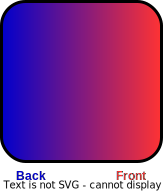
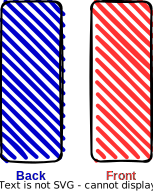
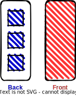
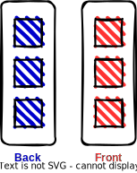
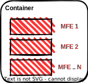

## Introduction

Micro Front-Ends, despite the fancy name, isn't something particularly new. As with most of the innovations, it's just a group of techniques that tries to solve a problem.

The problem here is building scalable apps with scalable teams. Not simple apps, but large and complex maintained by multiple teams.

**Micro Front-Ends** is very similar to Micro Services architecture. A lot of the concepts, challenges, and benefits are shared.

## Evolution

But first, it's interesting to understand the reason behind it. Like everything in development, things started simple and then get more complex. The software architecture evolves based on the problems we face daily.

Maybe oversimplifying, the evolution of web apps architecture regarding separation of code can be divided into four phases:

1. Monolith with back and front together
2. Separation from back and front
3. Back Micro Services, front Monolithic
4. Micro Front-Ends

The first phase was when the code executed on the server (AKA back-end) resides on the same repository that also lives the code executed on the client (AKA front-end). This kind of architecture is called **Monolithic Architecture**.

<!--  -->

Then we broke these two layers into back and front-end, creating two monolithic layers.

<!--  -->

As the back-end layer got more complex we started to break it into more manageable pieces. Which is called **Micro Services**.

<!--  -->

## Micro Front-Ends Architecture

And then we have the topic of this course. The front-end layer also got more complex and had to be broken up into smaller pieces. Bringing us to the subject of this course: **Micro Front-Ends**.

<!--  -->

Simply put, each MFE is a module that usually represents a Business Feature. They are decoupled from the container app and managed by an independent development team.

An MFE module usually doesn't work on its own, depending to be embedded in an app. This app can be called Container and has the responsibility of managing all the MFE modules in it.

<!--  -->

But differently than a common SPA application, everything is more complex. And some things have usually to be built in a slightly different way than in simpler apps.
