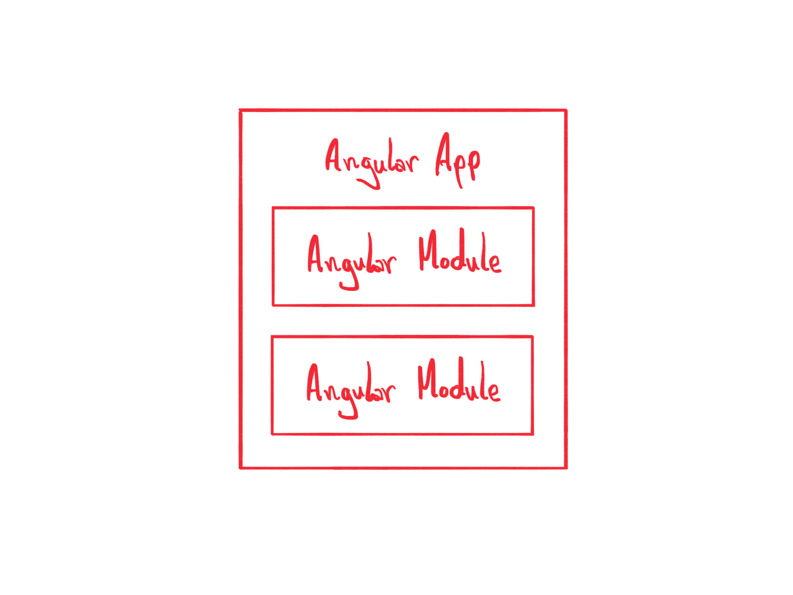
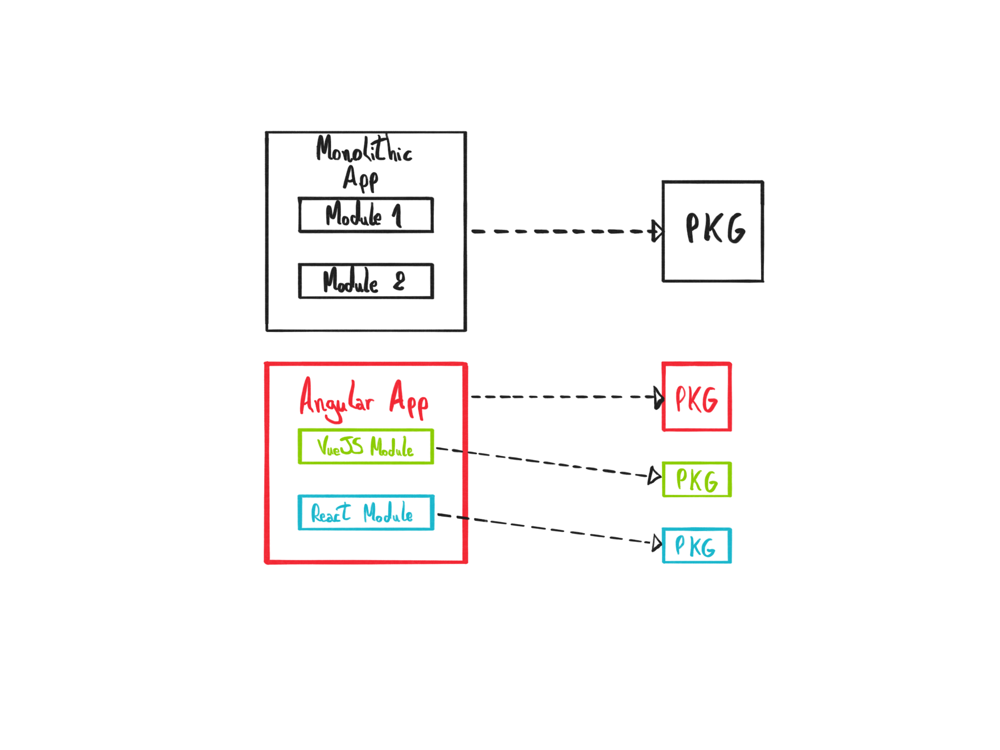

<!-- # MFE Benefits -->

In the last lesson, we saw what is MFE and some examples of it. In this lesson, we are going to see some of its benefits when creating an app using this type of architecture.

If you know about Micro Services, most of its benefits also apply to Micro Front-Ends. And they both are great when combined.

Let's see some of its benefits.

## Technology Agnostic

One thing that is commonly cited as an advantage in Micro Services is the freedom of choice regarding the technologies used in each service. And it's also true in Micro Front-Ends.

When creating a monolithic app, the framework used to develop it has to be the same in every module in it. For example, if the app is developed in Angular, you have to stick with it in all the app.

A *Micro Front-Ends* architecture brings the freedom to choose any framework in every single module.

## Isolation

Similar to what is possible in Micro Services, MFE modules can be isolated from the container app. It means this module can make choices that will only be available in it.

The first benefit of this isolation is *styling*. If you are working on a monolithic application, any business module in it has to follow the same style. It is that way because the CSS is shared across all the modules. Using MFE, you can isolate any module *to not inherit the container app style* and make it, if necessary, totally different.

For some, one of the major issues now in the JavaScript framework world is how fast things move. Angular, for example, has a new version twice a year. Although it's great for innovation, some companies just can't keep up with that. Again, using MFE *each module can use any framework version it needs*. Also, it's possible to *update* each module independently, making this process a bit easier.

On monolithic applications, *third-party libraries* are usually shared across all modules in it. For small applications, it may be ok. But for really big applications maintained by multiple teams, it gets frustrating quickly. Here, on MFE architectures, is possible to use completely *different libraries on each module*.

It is all possible because *MFE modules can be entirely self-contained*. Meaning it can embed any library, framework, style, or anything else it needs. Although possible, it doesn't depend on the container on common scenarios.

## Independent Development

As each MFE module is isolated from the other modules and the container app, its life cycle also doesn't depend on them. It's possible to have *development phases completely separated from the rest of the application*.

This is possible not only because of the isolation cited before but also due to the possibility of *independent deployment*. It means that an MFE module may not be deployed on the same infrastructure as the container app. For example, the container app can be hosted on AWS and the MFE module live in the Azure environment. Or maybe in different PODs in a Kubernetes cluster.

As each module can be deployed separately, it's easier to *ship features independently* of the container app. The team responsible for the maintenance of an MFE module can try new things with less risk of breaking the entire app.

## Scalability

The independence of deployment also makes it easier to *scale the infrastructure of each feature independently*.

It's possible, for example, to give more juice to the container app infrastructure while limiting the resources given to each MFE module.

It depends on the needs of the application and its users.

## Multiple teams

This aspect has been mentioned before. But an MFE architecture makes it possible to have *multiple teams working seamlessly on the same app*. Each team can make any changes to the code with less impact on the others' work. The independent deployment aspect makes it very easy to maintain a large app using MFE architecture.

This way, it's possible to have *a separate team responsible for each MFE module*. Therefore, the teams don't have to think about how the container app is structured, nor how to not break other features on it. It can lead to the development of multidisciplinary teams, with less needy for separation between front and back-end teams.

On really large apps, where multiple teams are working on it, this kind of architecture helps to scale the development process. We now have the freedom to accelerate or slow down the development of any feature we want with less impact on the entire process.

## Reusability

Depending on the strategy to build the modules, they can be *reusable on different apps*. The architecture must be well defined, but it's possible to reuse the modules. Of course, if that makes sense.

The way we are going to build the modules here will make it possible. Different than other approaches, we are going to use the APIs provided by the browser, not by a particular framework or library.

## Conclusion

In this lesson, we saw some advantages of creating an app using an MFE architecture. But like anything, it also has its disadvantages. And that we are going to see in the next lesson.
