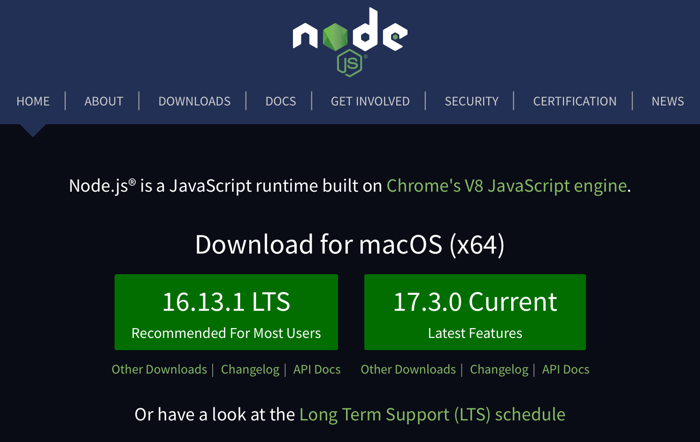
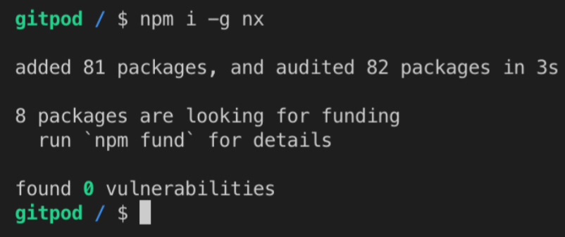

<!-- Preparing the Environment -->

## Summary

In this lesson, you are going to prepare your dev environment.

## Content

As we are building a front-end application, we are going to use two of the most popular front-end frameworks available nowadays: React and Angular.

Both of these frameworks run on top of Node, which will be required on the dev environment to do some needed tasks to develop an app: building and serving locally.

## Installing NodeJS

So let's start installing NodeJS, which can be downloaded from its official page: <https://nodejs.org/>.

But on that page, there's an indication of two NodeJS versions: LTS and Current.

<!--  -->

It's always recommended to download the LTS version because it's more stable. The Current version is not beta, but LTS is more stable. So just follow the instructions presented when you click the  LTS indication and you are good to go.

After downloading and installing Node, it's always good to test it with a simple command: `node -v`.

<!--  -->

Another good way to test Node is running a rather cool command: `npx cowsay Hello!`.

<!--  -->

> If it asks for permission to download a dependency, type `y` (yes) and enter to continue.

## Installing Nx

After a successful installation of Node, it's time to install one of the most important pieces of this course: Nx.

As said before, Nx has a lot of advantages and will help us a lot during our journey. Its documentation can be found at: <https://nx.dev>.

It's not mandatory, but a way to get Nx is simply installing it globally using `npm`. So, open up your terminal, type `npm install -g nx`, and hit enter.

<!--  -->

## Integrated Development Environment (IDE)

There are some IDEs available for front-end development, but the most popular is Visual Studio Code. VSCode can be downloaded at: <https://code.visualstudio.com>. The installation instructions are also on this site.

You are not obligated to install VSCode, but this is the IDE that will be used throughout this course.

## Optional

If you installed VSCode, there are some extensions that might help during the development of any front-end application. Which are:

- [Angular Language Service](https://marketplace.visualstudio.com/items?itemName=Angular.ng-template)
- [Nx Console](https://marketplace.visualstudio.com/items?itemName=nrwl.angular-console)

Those are the most helpful for the things we are going to build. But there are loads of extensions that can be found on the extensions tab right in VSCode or using their official website: <https://marketplace.visualstudio.com/VSCode>.

And that's it!
